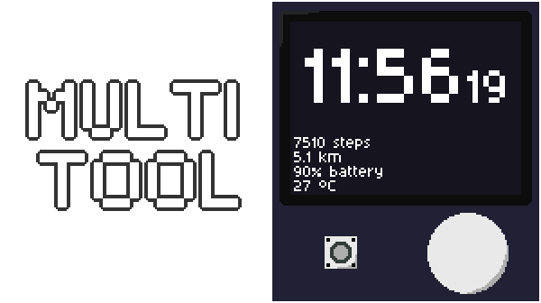

  

**A small pocket-sized clock, compass and distance tracker in one! It's built for hiking and is designed for ultra-low power.**

## What is it, really?
It is a minimalist gadget/device, with functions between watch and a phone. The content will be displayed on a 1.32 inch 128x96 monochrome oled display, and the brain will be Seeed XIAO nRF52840. I want for it to have a retro feel, so most of the UI will be text-based.

## Why?
When I went on a trip to nature, I found a phone to be too much power-hungry. But I also wanted something more than a watch, something that will have distance tracking, compass and other useful things for being and navigating in nature. Maybe even throw some simple games like pong in there for fun in the train. And the ideas and desire for this thing just kept rolling and growing.

## The features
*Since I don't have the hardware parts yet, I'm not able to write code for all the features that are promised, because having the display and sensors is very important for testing.*
### The main screen
This is where most of the useful info will be located. It will have:
- **A clock**, either in 24h or 12h format, with seconds
- **Steps counter** for a trip, calculated with accelerometer and gyroscope when in a pocket
- **Distance** for a trip, either estimated through steps count or with gps
- **Battery charge level**
- **Temperature** obtained from `MPU-6500`

### The compass
At the center of this page, there will be a rotating compass with the azimuth in the center. In each corner of the screen, there is a slot for a POI (point of interest), which can be either:
- **Direction** (azimuth)
- **GPS Coordinates**, which can be saved to current location or manually entered coordinates

POIs let you mark the bearing or coordinates of your next waypoint, or store a spot like where you left your backpack so you can find your way back.

### UI Navigation
Moving around the ui will be done with 2 hardware components:
- **Pushable rotating crown**
  - Push: When the crown is pushed on a page, it will open a menu, which can be used for example for adding POIs. When the user is already in a menu, it will confirm the selected choice.
  - Rotate: When on a page, rotating will be used for switching pages. When in a menu, it will move between options.
- **Back button** - this is the second button, which will be as an "Esc" key. It will back out of any menu.

## Power expectations
This will have a 550mAh Lipo battery, which should power the device for roughly 38 hours, but if I manage to properly optimize sleep, it could be higher. But even if it was 38 hours, it won't take much of capacity of an external powerbank, especially when compared to a phone.

## 3D model
*Please note that the parts that appear floating will be glued to a wall of the case.* 

## Wiring

## Bill Of Materials
|Item                                   |Quantity|Price (USD)|Shipping (USD)|Total Price (USD)|Note                                                                                                     |Link                                                 |
|---------------------------------------|--------|-----------|--------------|-----------------|---------------------------------------------------------------------------------------------------------|-----------------------------------------------------|
|Seeed Studio XIAO nRF52840             |1       |$5.15      |$1.72         |$6.87            |                                                                                                         |https://www.aliexpress.com/item/1005004459618789.html|
|1.32inch OLED Display Module           |1       |$5.49      |$6.00         |$11.49           |I know I should buy from aliexpress but from the official waveshare store is the cheapest place to buy it| https://www.waveshare.com/1.32inch-oled-module.htm  |
|GY-271 QMC5883L Magnetometer           |1       |$1.92      |$0.00         |$1.92            |Shipping is free due to aliexpress choice                                                                |https://www.aliexpress.com/item/1005007183006706.html|
|MPU-6500 6-Axis Accelerometer Gyroscope|1       |$2.03      |$0.00         |$2.03            |Shipping is free due to aliexpress choice                                                                |https://www.aliexpress.com/item/1005008913624575.html|
|DS3231 Real Time Clock                 |1       |$1.80      |$0.00         |$1.80            |Shipping is free due to aliexpress choice                                                                |https://www.aliexpress.com/item/1005006885926027.html|
|GT-U7 GPS module                       |1       |$6.80      |$0.00         |$6.80            |Shipping is free due to aliexpress choice                                                                |https://www.aliexpress.com/item/1005001713388717.html|
|Lipo Battery                           |1       |$9.01      |$2.68         |$11.69           |This was the best battery i could find when comparing size and capacity                                  |https://www.aliexpress.com/item/1005006666958920.html|
|360 Degrees Rotary Encoder Module      |1       |$1.28      |$0.00         |$1.28            |Shipping is free due to aliexpress choice                                                                |https://www.aliexpress.com/item/1005006579651632.html|
|Tactile push button                    |1       |-          |-             |-                |I will be buying this with my own money from a local shop                                                |-                                                    |
|2x16mm Screw                           |4       |-          |-             |-                |I already have it, it's for screwing the layers together                                                 |-                                                    |
|                                       |        |           |              |                 |                                                                                                         |                                                     |
|Total Cost                             |        |           |              |$43.88           |                                                                                                         |                                                     |
